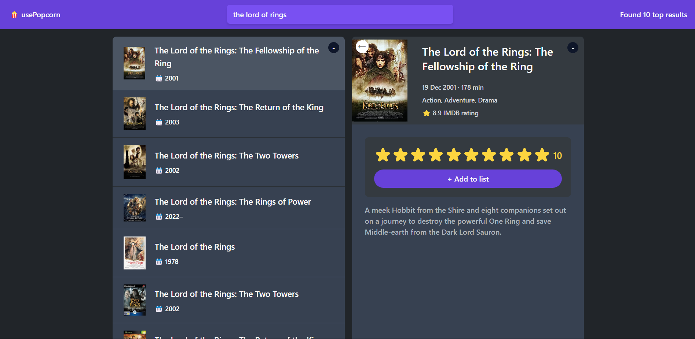

# 🍿 usePopcorn

> A website to rate your favorite movies and add them to your watchlist.

</img>

## Try it Live!

Check out the live app [usePopcorn](https://use-pop-corn-react.vercel.app/)

## How to Use

**Search for a movie :**

-   Type a movie that you want to search for in the search bar.
-   The app will fetch the data from the api then displayed on the left section.

**Rate a movie**:

-   Select a movie from left section then the right section will display the movie.
-   Click on a star to rate the movie (stars rate starting from zero to ten from left to right).

**Add to list**:

-   After clicking on any star a button will be visible then click on the button to added to the list.

## Features

-   Created search bar to search for a specific movie.
-   Used odmb api to fetch movies data and displayed on the app.
-   Added the functionality to rate a movie and to add it to the watched list.
-   Created a function that gets the count of all movies watched, the average rating from your rated movies and watched time.

## Tools Used

-   TypeScript
-   React
-   TailwindCSS
-   Omdb API
-   Vite

## Getting Started

1. Clone this repository.

    ```bash
    git clone https://github.com/mahmoud-mohsen-dev/usePopcorn.git
    ```

2. Navigate to the Project Directory:
    ```bash
    cd usePopcorn
    ```
3. Install Dependencies:

    ```bash
     npm install
    ```

4. Start the Development Server:

    ```bash
    npm run dev
    ```

5. Open in your Browser:

    Open your web browser and go to http://localhost:3000 to see the app in action.

Now you have the "usePopcorn" app up and running on your local machine.

_This poject was part of The Ulitmate React Couse_
